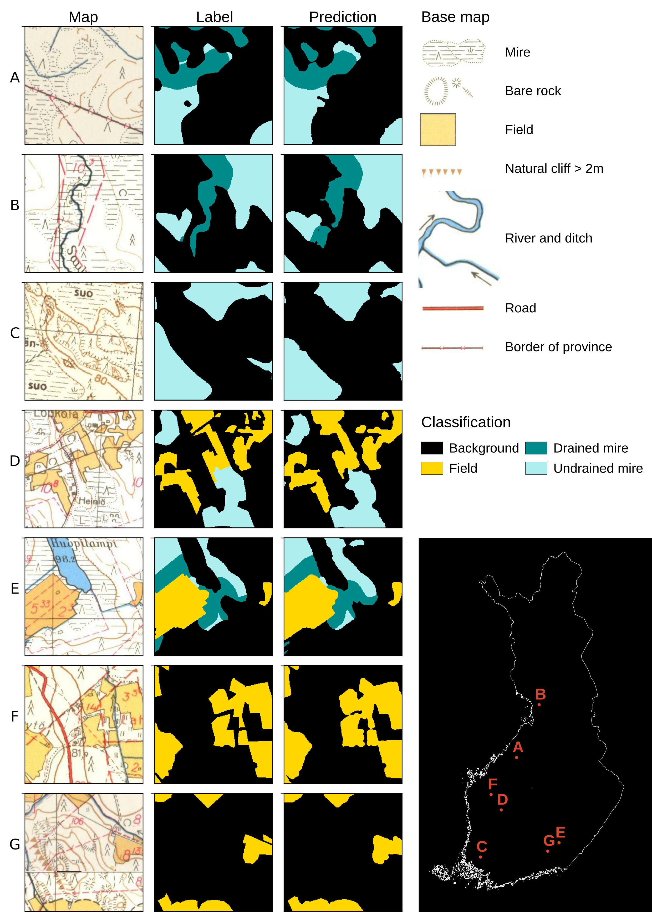
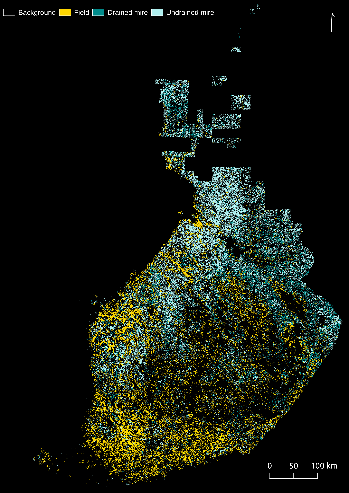

# Map Processing of Historical Finnish Base Maps
This repo hosts code used in my master's thesis (in Finnish), and also includes short summary of my results
# Readme is under construction

Example Base map and the base map grid of maps made before 1979. The maps are made by and available from [National Land Survey of Finland](https://vanhatpainetutkartat.maanmittauslaitos.fi/)
# Methods
- Classification was done to all Finnish base maps that were published between 1949 and 1978 (approximately 3000 map sheets). 
# Results

The trained CNN learned to detect fields, drained mires and undrained mires with high overall accuracy

Map of classification for the whole of Finland for newest versions of maps by 1978

